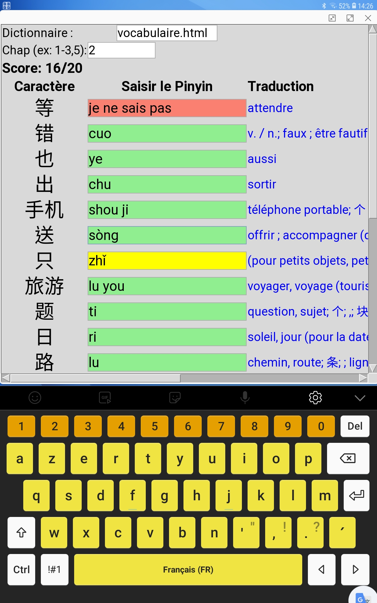
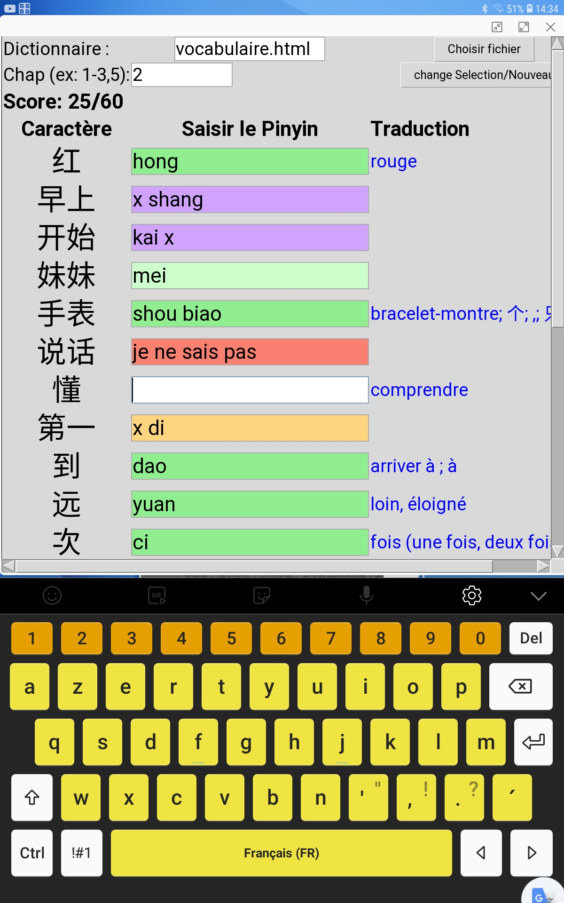

# 🈶 HSK Pinyin Trainer

**HSK Pinyin Trainer** est une application interactive pour apprendre les caractères chinois, leur prononciation (pinyin), et leur traduction en français.  
Elle s’adresse aux apprenants du chinois mandarin, notamment dans le cadre du HSK (niveaux 1 à 6).

---

## 🚀 Fonctionnalités

- Entraînement sur **20 mots chinois aléatoires**
- **Saisie du pinyin** avec retour visuel :
  - ✅ Vert clair : réponse correcte
  - 🟪 Violet / 🟧 Orange : partiellement correcte (mot juste ou mal placé)
  - 🔴 Rouge : incorrect... à partir du pinyin tapé cherche les caractères chinois correspondant ('?' le premier caractère, '!' tous les caractères) 
  - 🟩 Vert pâle : début correct
- Aide intégrée :
  - `,` → Affiche le pinyin
  - `.` → Affiche la traduction
  - `?` → Aide ciblée sur premier mot erroné
- 📊 Suivi automatique des progrès
- 🔊 Prononciation via page externe (clic sur le caractère chinois)

---

## 📱 Installation (Android via Pydroid 3)

1. Installez **Pydroid 3** depuis le Play Store  
   👉 https://play.google.com/store/apps/details?id=ru.iiec.pydroid3

Après avoir installé Pydroid 3 :
   - Ouvrir Pydroid 3
   - Aller dans le menu (≡ en haut à gauche) → Pip
   - Installer les bibliothèques suivantes une par une :
     - pip install beautifulsoup4
     - pip install unidecode
     - pip install requests
     - pip install playsound

📝 Remarque :
Si playsound ne fonctionne pas sur votre appareil, vous pouvez utiliser l’option de prononciation intégrée au site frdic.com, accessible en cliquant sur le caractère chinois dans l'application.

2. Téléchargez et décompressez l'archive `HSKTrainer_Android.zip`

### 🔽 Comment décompresser l’archive `.zip` sur Android

Si vous ne savez pas comment faire :

1. Ouvrez votre application **“Fichiers”** (ou **“Mes fichiers”**, selon la marque du téléphone)
2. Allez dans le dossier **Download** ou l’endroit où le fichier `HSKTrainer_Android.zip` a été téléchargé
3. Appuyez longuement sur le fichier `HSKTrainer_Android.zip`
4. Appuyez sur **“Extraire”** ou **“Décompresser”**  
   *(sur certains téléphones, cette option se trouve dans un menu ⋮ en haut à droite)*
5. Un dossier `HSKTrainer_Android/` sera créé automatiquement  
   ➜ C’est ce dossier que vous ouvrirez ensuite depuis **Pydroid 3**

---

📌 **Si votre téléphone ne propose pas d’option de décompression :**

Installez une application gratuite comme :

- ✅ **ZArchiver**
- ✅ **RAR**  
  *(disponibles sur le Play Store)*

3. Ouvrez **Pydroid 3**, puis :
   - Menu → Open → sélectionnez `hsk_trainer.py`
   - Appuyez sur ▶️ **Run**

---

## 🧰 Fichiers inclus

- `hsk_trainer.py` → Le programme principal
- `vocabulaire.html` → Le dictionnaire de travail (modulable)
- `rapport_progression.csv` → Fichier généré automatiquement
- `README.md` → Ce document

---

## 🧠 Utilisation

- Tapez le **pinyin attendu** pour chaque caractère
- Observez le **retour visuel immédiat**
- Cliquez sur un caractère pour accéder à la **prononciation sur frdic.com**

---

### 🖼️ Aperçu de l’application

Voici un exemple d’écran de l’application en cours d’utilisation :

---

## 📎 Format attendu du dictionnaire HTML

|dummy| HSK/chap  | Caractère | Pinyin | Traduction  |
|-----|-----------|-----------|--------|-------------|
|     | 1         | 我        | wǒ     | je / moi    |
|     | 1         | 是        | shì    | être        |

Le fichier doit être un tableau HTML avec au moins 5 colonnes.

---

## 👨‍🏫 Auteur

Projet développé pour l’apprentissage autonome ou en classe.  
Créé avec ❤️ en Python + Tkinter.  
Compatible Windows et Android (via Pydroid 3).

---

